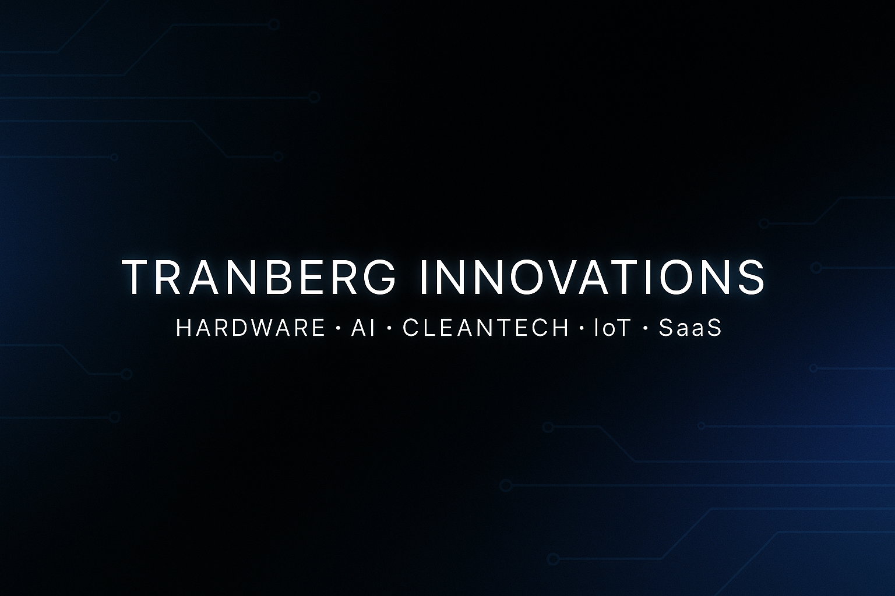

  

# 👋 Hey, I’m **Jay Tranberg**

### 🧠 Full-Stack Engineer • AI Builder • IoT Innovator  
Building real systems end-to-end — from embedded firmware and BLE provisioning to scalable SaaS apps, AI assistants, predictive dashboards, and full commercial product launches.

---

## ⚡ What I’m Building

### **MAGNETS (Project Snowman)** — exhaust-flow conditioning & IoT telemetry platform  
*Modular clean-tech R&D with embedded systems + live analytics.*

- ESP32-S3 firmware with secure BLE pairing  
- Modular C++ architecture using S.O.L.I.D. principles  
- Live React dashboard with trend views + health scoring  
- Predictive analytics + maintenance cues  
- 85% reduction in API overhead → faster, cheaper cloud operation  
- Active TRL-5 testing, TRL-6 in progress  

---

### **Color Mixer Pro** — Commercial SaaS with Stripe Billing  
A pro-grade color theory + AI palette generation platform.

- Vite + Node backend  
- MongoDB + secure auth  
- Stripe subscriptions + webhooks  
- Deployed as a production SaaS  

---

### **DR.Epidermus / SkinScan** — AI skin diagnosis mobile app  
Real-time skin condition classification + recommendations.

- TensorFlow/Keras & Flask backend  
- Expo React Native app  
- Gemini AI for doctor/clinic recommendations  
- 3-model prediction architecture (triage → full model → treatment mapping)  

---

### **The In and Out App** — Inventory & equipment tracking SaaS  
Built for crews, departments, and small businesses.

- MERN stack  
- JWT auth, role-based access  
- Item lending, returns, logs, and reporting  
- Launched for real teams in production  

---

### **Historically Accurate** — AI-driven image generation + upscaling  
Hyper-real historical photography powered by FAL API.

- Next.js frontend  
- Backend “magic prompt” engine  
- Automatic image → upscaler pipeline  
- Production-ready deployment  

---

## 🛠 **Tech I Work With**

### **Languages**
JavaScript • TypeScript • C++ • Python • Java • SQL

### **Frameworks & Tools**
React • Next.js • Expo • Node.js • Express  
Flask • TensorFlow/Keras • MongoDB • PostgreSQL  
PlatformIO • ESP32 • Docker • Stripe API • CI/CD Pipelines

### **Specialties**
- 🚀 Full-stack SaaS architecture  
- ⚡ Embedded systems & IoT firmware  
- 🤖 AI/ML integrations for real-world use  
- 📡 BLE & wireless provisioning flows  
- 📊 Predictive dashboards and analytics  
- 🧪 Rapid prototyping → deployment  

---

## 🧩 **What I Love Working On**
- AI-assisted tools with practical benefits  
- Real-world IoT systems with telemetry + prediction  
- Clean-tech hardware + embedded firmware  
- SaaS products that scale efficiently  
- Simple, elegant UX that masks complex systems  

---

## 🧪 Featured Projects

| Project | Tech Stack | Highlights |
|--------|------------|------------|
| **Project Snowman** | ESP32, C++, BLE, React, AI | IoT exhaust-flow conditioning + predictive dashboard |
| **Color Mixer Pro** | Vite, Node, MongoDB, Stripe | Commercial SaaS with subscriptions |
| **DR.Epidermus** | TensorFlow, Flask, Expo, Gemini | AI skin diagnosis with 8-class model |
| **In and Out App** | MERN + SaaS | Team gear tracking & lending |
| **Historically Accurate** | Next.js, FAL API | AI historical image generator |

---

## 📫 **Reach Me**
📧 **jtranberg@hotmail.ca**  
🔗 **LinkedIn:** https://linkedin.com  
📍 Victoria, BC  
🌐 tranberginnovations.com  

---

⚙️ **I build products that merge hardware, AI, and software—and I always ship.**  
